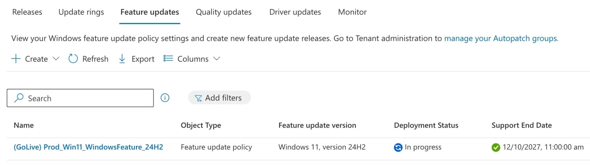
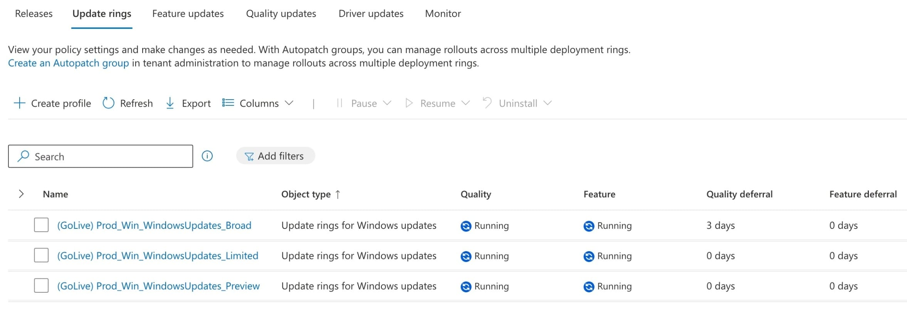
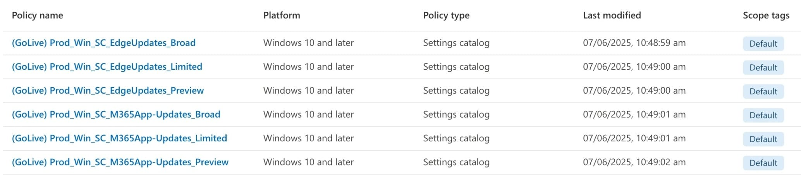

# Intune Baseline

Microsoft Intune baseline configurations.

## windows

Compliance policies and device configuration profiles for core Windows scenarios including Windows PCs, Windows 365 and Azure Virtual Desktop. Covers basic Windows settings, Microsoft Edge and the Microsoft 365 Apps to deliver an enterprise end-user experience.

## windows-update

Policies to manage Windows feature updates, along with Microsoft Edge and the Microsoft 365 Apps. Support the use of Windows Autopatch.

